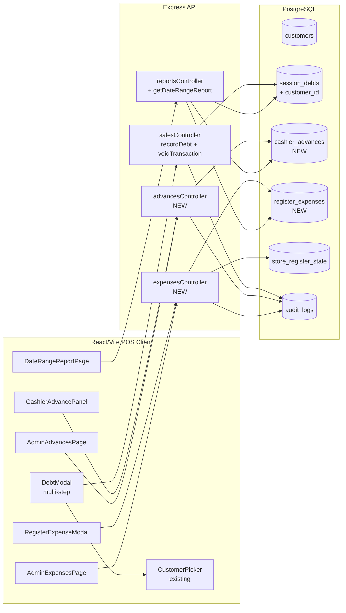
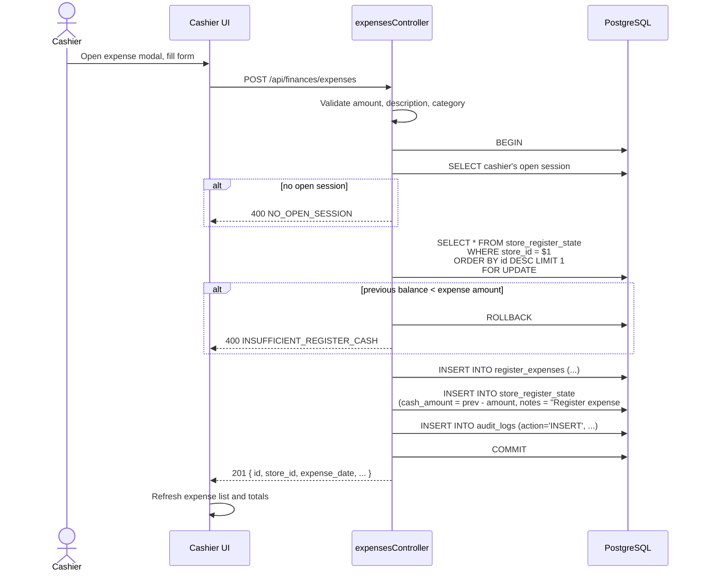
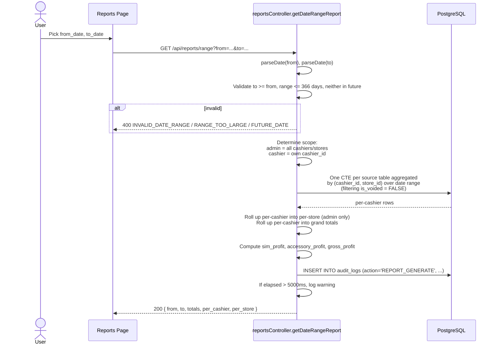
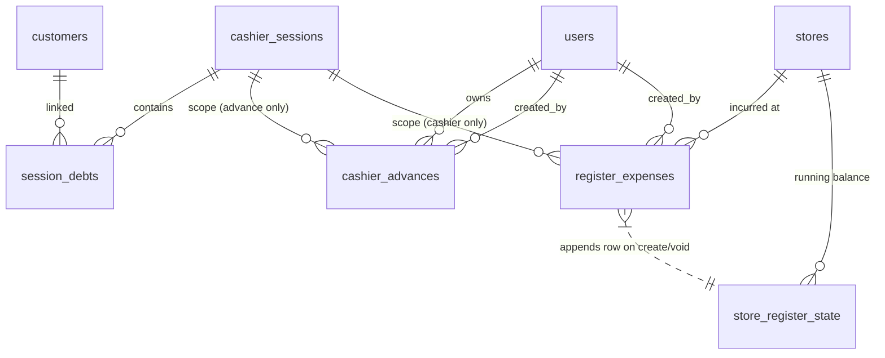

# Design Document

## Overview

This feature extends the Ooredoo POS system with four interrelated financial-tracking capabilities, layered onto the existing Node.js/Express + PostgreSQL + React/Vite stack:

1. **Customer-linked debt recording** — turns the existing single-input "Record Client Debt" into a multi-step modal that mirrors the SIM sale flow, mandates a `customer_id` on every `session_debts` row, and migrates legacy NULL `customer_id` rows onto a designated placeholder customer.
2. **Cashier advances** — a new `cashier_advances` table tracks money a cashier withdraws from the register for personal use, with admin-recorded repayments. Outstanding balance is computed as `SUM(advance) - SUM(repayment)` over non-voided rows. The register cash balance is intentionally **not** auto-adjusted (the admin retains explicit control via the existing `updateRegister` endpoint).
3. **Register expenses (La Caisse)** — a new `register_expenses` table records operational spend out of the register. Each expense atomically appends a new row to `store_register_state` reducing the running balance, inside a `SELECT ... FOR UPDATE` lock on the latest register state row to prevent concurrent over-spending. The schema's existing `cash_amount >= 0` CHECK constraint serves as the final guard. Voids reverse the deduction symmetrically.
4. **Date-range reports** — a new on-demand reporting endpoint computes consolidated totals across `[from_date, to_date]` from live tables (not from the immutable `daily_reports` snapshots), supporting per-cashier breakdown, per-store rollup (admin only), and grand totals. Cashiers see only their own data; admins see everything.

The design preserves all existing conventions:

- **Audit logging** via the existing `audit_logs` table and `audit()` helper (fire-and-forget for inserts, in-transaction for register-cash mutations).
- **Soft-void pattern** (`is_voided`, `voided_at`, `voided_by`, `void_reason`) on every new mutable row.
- **Snapshot columns** are not introduced for advances or expenses (no underlying catalog rows to drift from), but expense `category` is a closed enum to keep the data shape stable.
- **Session-ownership / role-based access** through the existing `authenticate` and `authorize` middlewares.
- **Latest-row-wins** running state for `store_register_state`, matching how `updateRegister` already works.

All monetary values are in Algerian Dinar (DZD), matching the rest of the system.

### Research Notes

- **Concurrency on `store_register_state`**: The existing `updateRegister` controller reads the latest row, computes `next = current ± delta`, and inserts a new row, all inside a `withTransaction` block — but it does not lock the previous row. With register expenses created concurrently from multiple cashier devices, two simultaneous expenses could each read the same "previous balance" and both succeed, double-spending the register. The design mitigates this by adding `SELECT ... FOR UPDATE` on the latest state row inside the new expense controller, and by relying on the `cash_amount >= 0` CHECK constraint as a final guard. The existing `updateRegister` is left unchanged for this iteration since admin updates are infrequent and serial; if needed, the same lock can be retrofitted.
- **`session_debts.customer_id` migration**: The current schema has no `customer_id` column on `session_debts` (only `session_sim_sales`, `session_storm_entries`, and `session_accessory_sales` got the link in migration `1000000000003`). Adding a NOT NULL FK requires a placeholder customer for any pre-existing rows. The placeholder is created idempotently using `ON CONFLICT (phone_number) DO NOTHING` against the existing `customers.phone_number` UNIQUE constraint.
- **Date semantics**: PostgreSQL's `CURRENT_DATE` resolves in the connection's timezone. The application server runs with a single local timezone; the requirements call this `Server_Local_Date` and use it as the single basis for all date comparisons. The design avoids client-supplied timestamps for date checks — all `expense_date`, `from_date`, `to_date`, and "is this today" comparisons are evaluated server-side via `CURRENT_DATE` or against parsed `YYYY-MM-DD` strings.
- **Date-range report aggregation grain**: Two viable approaches: (a) aggregate per-cashier first, then roll up to per-store; (b) issue separate queries per dimension. Approach (a) is chosen because it makes per-store totals provably consistent with the per-cashier rows and keeps the SQL count low (one CTE per source table, joined to a `cashier_sessions` filter). Approach (b) would risk drift from differing WHERE clauses.
- **Reusing `CustomerPicker`**: The existing `CustomerPicker.jsx` component already implements phone-lookup → confirm-existing or create-new. The new `DebtModal` reuses it verbatim, matching the SIM sale flow exactly per Requirement 1.1.

## Architecture

### High-Level Component Map



### Request Flow: Register Expense Creation



### Request Flow: Date-Range Report



### Backend Module Layout

New files:

- `src/controllers/advancesController.js` — list/create/void cashier advances and admin-recorded repayments.
- `src/controllers/expensesController.js` — list/create/void register expenses.
- `src/routes/advancesRoutes.js` — mounts at `/api/advances` (mixed cashier + admin).
- `src/routes/expensesRoutes.js` — mounts at `/api/finances/expenses` to keep all cash-flow endpoints under `/api/finances`.

Modified files:

- `src/controllers/salesController.js` — `recordDebt` now requires `customer_id` and accepts the existing customer-resolution flow.
- `src/controllers/reportsController.js` — adds `getDateRangeReport`.
- `src/routes/reportsRoutes.js` — adds `GET /api/reports/range`. Note: existing `/api/reports/*` is admin-only; the new range endpoint is mounted on a sub-router that allows cashiers (their data is auto-restricted server-side).
- `src/server.js` — registers the two new route modules.

New migration: `migrations/1000000000005_financial-extensions.js` — adds the new tables, the FK on `session_debts`, the placeholder customer, and rebuilds `v_session_live_totals` to subtract register expenses on the cash-on-hand calculation.

### Frontend Component Layout

New components in `ooredoo-pos-client/src/components/`:

- `DebtModal.jsx` — multi-step modal mirroring `SimSaleModal` (customer step → amount step → review).
- `RegisterExpenseModal.jsx` — single-step modal with amount, description, category dropdown. Mounted from both POS dashboard and admin expenses page (admin variant exposes `expense_date` and `store_id` fields).
- `CashierAdvancePanel.jsx` — embedded panel on the POS dashboard showing the cashier's outstanding balance and a "Record advance" button.

New pages in `ooredoo-pos-client/src/pages/admin/`:

- `AdminAdvances.jsx` — list of cashier outstanding balances with per-cashier history + "Record repayment" action.
- `AdminExpenses.jsx` — list of all expenses across stores with filters.
- `DateRangeReports.jsx` — calendar-based date-range picker, totals grid, per-cashier table, per-store rollup, drill-down sections.

New page in `ooredoo-pos-client/src/pages/cashier/`:

- `CashierDateRangeReport.jsx` — calendar-based picker showing only the cashier's own per-cashier section and totals.

The existing `Layout.jsx` gains two admin nav links (`Advances`, `Expenses`) and renames the existing `Reports` link target to a tab page that surfaces both the existing daily-report list and the new date-range report.

### Authorization Matrix

| Endpoint | Cashier | Admin | Notes |
|---|---|---|---|
| `POST /api/sales/debt` | ✅ own session, customer required | ❌ | Existing endpoint, body now requires `customer_id`. |
| `POST /api/sales/debt/:id/void` | ✅ own session row only | ✅ any | Existing void route extended for debt. |
| `POST /api/advances` | ✅ direction='advance' only, own open session | ❌ | Cashier cannot record repayments. |
| `POST /api/advances/repayment` | ❌ | ✅ direction='repayment' for any cashier | Admin-only. |
| `GET /api/advances/me` | ✅ own ledger + balance | ❌ | Cashier sees own data. |
| `GET /api/advances` | ❌ | ✅ all cashiers' balances | Admin overview. |
| `GET /api/advances/cashier/:id` | ❌ | ✅ specific cashier history | Admin drill-down. |
| `POST /api/advances/:id/void` | ✅ own current-session row | ✅ any non-voided row | Per Req 2.11/2.12. |
| `POST /api/finances/expenses` | ✅ own open session, today only | ✅ any store, any non-future date | Per Req 3.4/3.5/3.6. |
| `GET /api/finances/expenses/me` | ✅ own current-session expenses | — | Cashier panel. |
| `GET /api/finances/expenses` | ❌ | ✅ all stores with filters | Admin overview. |
| `POST /api/finances/expenses/:id/void` | ✅ own current-session row | ✅ any non-voided row | Per Req 3.13/3.14. |
| `GET /api/reports/range` | ✅ scope auto-restricted to self | ✅ all cashiers/stores | Per Req 4.4/4.5. |

## Components and Interfaces

### REST API Endpoints

#### Cashier Advances

```
POST   /api/advances
  Auth:  cashier
  Body:  { amount: number, note?: string }
  201:   { id, cashier_id, session_id, direction: 'advance', amount, note, created_at }
  Errors: 400 NO_OPEN_SESSION | 400 INVALID_AMOUNT

POST   /api/advances/repayment
  Auth:  admin
  Body:  { cashier_id: number, amount: number, note?: string }
  201:   { id, cashier_id, session_id: null, direction: 'repayment', amount, note, created_at,
           outstanding_balance: number }
  Errors: 400 INVALID_AMOUNT | 400 REPAYMENT_EXCEEDS_BALANCE { current_balance } | 404 CASHIER_NOT_FOUND

GET    /api/advances/me
  Auth:  cashier
  Query: limit (default 50, max 200), offset
  200:   { outstanding_balance: number, items: [{ id, direction, amount, note, created_at, is_voided }] }

GET    /api/advances
  Auth:  admin
  200:   [{ cashier_id, cashier_name, store_id, store_name,
            outstanding_balance, last_activity_at }]  // sorted desc by balance

GET    /api/advances/cashier/:id
  Auth:  admin
  Query: limit, offset
  200:   { cashier: {...}, outstanding_balance, items: [...] }

POST   /api/advances/:id/void
  Auth:  cashier (own current-session) OR admin (any non-voided)
  Body:  { reason: string }   // 1..500 chars after trim
  200:   { id, is_voided: true, voided_at, voided_by }
  Errors: 403 FORBIDDEN | 409 ALREADY_VOIDED | 400 MISSING_VOID_REASON | 400 INVALID_VOID_REASON
```

#### Register Expenses

```
POST   /api/finances/expenses
  Auth:  cashier OR admin
  Body (cashier): { amount, description, category }
  Body (admin):   { amount, description, category, expense_date?, store_id }
  201:   { id, store_id, session_id, amount, expense_date, description, category,
           created_at, register_balance_after: number }
  Errors: 400 NO_OPEN_SESSION (cashier no session) | 400 BACKDATE_FORBIDDEN (cashier with non-today date) |
          400 FUTURE_DATE | 400 VALIDATION_ERROR | 400 INSUFFICIENT_REGISTER_CASH { current_balance }

GET    /api/finances/expenses/me
  Auth:  cashier
  Query: limit (default 50, max 200), offset
  200:   [{ id, amount, description, category, expense_date, created_at, is_voided, void_reason }]

GET    /api/finances/expenses
  Auth:  admin
  Query: store_id?, category?, from?, to?, voided? (true|false|all default 'false'),
         limit (default 50, max 200), offset
  200:   [{ id, store_id, store_name, session_id, cashier_name, amount, description,
            category, expense_date, created_at, is_voided, void_reason, voided_at }]

POST   /api/finances/expenses/:id/void
  Auth:  cashier (own current-session) OR admin (any non-voided)
  Body:  { reason: string }   // 1..500 chars after trim
  200:   { id, is_voided: true, voided_at, voided_by, register_balance_after: number }
  Errors: 403 FORBIDDEN | 409 ALREADY_VOIDED | 400 MISSING_VOID_REASON | 400 INVALID_VOID_REASON
```

#### Date-Range Report

```
GET    /api/reports/range
  Auth:  cashier (auto-scoped to self) OR admin
  Query: from=YYYY-MM-DD&to=YYYY-MM-DD
  200:   {
           from, to,
           totals: { sim_units_sold, sim_total_real_price, sim_total_selling_price,
                     sim_total_points, sim_total_commission,
                     storm_total,
                     accessories_total_selling, accessories_total_real, accessories_total_commission,
                     debt_total,
                     cashier_advance_total, cashier_repayment_total,
                     register_expense_total, register_expense_by_category: { utility, inventory, other },
                     sim_profit, accessory_profit, gross_profit },
           per_cashier: [{ cashier_id, cashier_full_name, store_id, ...same shape as totals }],
           per_store:   [{ store_id, store_name, ...same shape as totals }],   // admin only
           debts:       [{ id, amount, description, created_at, customer: { full_name, phone_number, profession } }],
           advances:    [{ cashier_id, cashier_full_name, advance_total, repayment_total, outstanding_balance }],
           expenses_by_category: { utility, inventory, other }
         }
  Errors: 400 INVALID_DATE_RANGE | 400 RANGE_TOO_LARGE | 400 FUTURE_DATE
```

### Existing `POST /api/sales/debt` Changes

```
POST   /api/sales/debt
  Auth:  cashier
  Body:  { session_id, customer_id, amount, description? }
  201:   { id, session_id, customer_id, amount, description, entered_at,
           customer_name }
  Errors: 400 NO_OPEN_SESSION | 400 VALIDATION_ERROR | 400 CUSTOMER_REQUIRED |
          404 CUSTOMER_NOT_FOUND
```

### Frontend Component Contracts

```
DebtModal({ sessionId, onClose, onComplete })
  // Steps: customer → amount → review
  // Reuses CustomerPicker; on confirm POSTs /api/sales/debt
  // amount: positive decimal, 2dp, [0.01, 9999999999.99]
  // description: 0..1000 chars after trim

RegisterExpenseModal({ mode: 'cashier' | 'admin', sessionId?, storeId?, onClose, onComplete })
  // mode='cashier': hides expense_date and store_id fields
  // mode='admin': exposes expense_date (date input) and store_id (select)
  // category: dropdown with 'utility' | 'inventory' | 'other'

CashierAdvancePanel({ cashierId, refreshKey })
  // Shows outstanding balance and "Record advance" button
  // Inline modal asks amount + optional note → POST /api/advances

AdminAdvances()
  // Renders GET /api/advances list, click row → drill-down with history
  // "Record repayment" action → POST /api/advances/repayment

AdminExpenses()
  // Filters: store, category, date range, void state
  // Pagination via limit/offset
  // Void action with reason input

DateRangeReport({ scope: 'admin' | 'cashier' })
  // Calendar pickers for from/to (max 366 days)
  // Renders totals card grid + tabs:
  //   Per-cashier | Per-store (admin only) | Debts | Advances | Expenses
```

## Data Models

### Migration: `1000000000005_financial-extensions.js`

```js
exports.up = (pgm) => {
  pgm.sql(`
    -- ─── 1. Placeholder customer for legacy debts ─────────────────────────
    INSERT INTO customers (phone_number, first_name, last_name, address, profession, notes)
    VALUES ('LEGACY-UNKNOWN', 'Unknown', 'Customer (legacy)', '—', '—',
            'Auto-created placeholder for pre-customer-link debts.')
    ON CONFLICT (phone_number) DO NOTHING;

    -- ─── 2. Add customer_id to session_debts ──────────────────────────────
    ALTER TABLE session_debts
      ADD COLUMN IF NOT EXISTS customer_id INT REFERENCES customers(id) ON DELETE RESTRICT;

    UPDATE session_debts
       SET customer_id = (SELECT id FROM customers WHERE phone_number = 'LEGACY-UNKNOWN')
     WHERE customer_id IS NULL;

    ALTER TABLE session_debts ALTER COLUMN customer_id SET NOT NULL;
    CREATE INDEX IF NOT EXISTS idx_debts_customer ON session_debts(customer_id);

    -- ─── 3. Cashier advances ──────────────────────────────────────────────
    CREATE TABLE IF NOT EXISTS cashier_advances (
      id            SERIAL          PRIMARY KEY,
      cashier_id    INT             NOT NULL REFERENCES users(id)            ON DELETE RESTRICT,
      session_id    INT             REFERENCES cashier_sessions(id)          ON DELETE RESTRICT,
      direction     VARCHAR(10)     NOT NULL CHECK (direction IN ('advance','repayment')),
      amount        NUMERIC(12, 2)  NOT NULL CHECK (amount >= 0.01 AND amount <= 9999999999.99),
      note          TEXT            CHECK (note IS NULL OR length(note) <= 500),
      is_voided     BOOLEAN         NOT NULL DEFAULT FALSE,
      voided_at     TIMESTAMPTZ,
      voided_by     INT             REFERENCES users(id) ON DELETE SET NULL,
      void_reason   TEXT            CHECK (void_reason IS NULL OR
                                           (length(trim(void_reason)) BETWEEN 1 AND 500)),
      created_at    TIMESTAMPTZ     NOT NULL DEFAULT NOW(),
      created_by    INT             NOT NULL REFERENCES users(id) ON DELETE RESTRICT,

      -- Advance entries must have a session; repayments must not.
      CONSTRAINT advance_has_session
        CHECK ((direction = 'advance'  AND session_id IS NOT NULL) OR
               (direction = 'repayment' AND session_id IS NULL))
    );

    CREATE INDEX IF NOT EXISTS idx_advances_cashier  ON cashier_advances(cashier_id);
    CREATE INDEX IF NOT EXISTS idx_advances_session  ON cashier_advances(session_id);
    CREATE INDEX IF NOT EXISTS idx_advances_active   ON cashier_advances(cashier_id)
      WHERE is_voided = FALSE;

    -- ─── 4. Register expenses ─────────────────────────────────────────────
    CREATE TABLE IF NOT EXISTS register_expenses (
      id            SERIAL          PRIMARY KEY,
      store_id      INT             NOT NULL REFERENCES stores(id)           ON DELETE RESTRICT,
      session_id    INT             REFERENCES cashier_sessions(id)          ON DELETE RESTRICT,
      amount        NUMERIC(12, 2)  NOT NULL CHECK (amount >= 0.01 AND amount <= 9999999.99),
      expense_date  DATE            NOT NULL,
      description   TEXT            NOT NULL CHECK (length(trim(description)) BETWEEN 1 AND 500),
      category      VARCHAR(20)     NOT NULL CHECK (category IN ('utility','inventory','other')),
      is_voided     BOOLEAN         NOT NULL DEFAULT FALSE,
      voided_at     TIMESTAMPTZ,
      voided_by     INT             REFERENCES users(id) ON DELETE SET NULL,
      void_reason   TEXT            CHECK (void_reason IS NULL OR
                                           (length(trim(void_reason)) BETWEEN 1 AND 500)),
      created_at    TIMESTAMPTZ     NOT NULL DEFAULT NOW(),
      created_by    INT             NOT NULL REFERENCES users(id) ON DELETE RESTRICT
    );

    CREATE INDEX IF NOT EXISTS idx_expenses_store_date ON register_expenses(store_id, expense_date DESC);
    CREATE INDEX IF NOT EXISTS idx_expenses_session    ON register_expenses(session_id);
    CREATE INDEX IF NOT EXISTS idx_expenses_active     ON register_expenses(store_id)
      WHERE is_voided = FALSE;
    CREATE INDEX IF NOT EXISTS idx_expenses_category   ON register_expenses(category);
  `);
};

exports.down = (pgm) => {
  pgm.sql(`
    DROP TABLE IF EXISTS register_expenses;
    DROP TABLE IF EXISTS cashier_advances;
    ALTER TABLE session_debts DROP COLUMN IF EXISTS customer_id;
    -- Placeholder customer is intentionally NOT removed: deleting it would
    -- cascade-restrict if any debts still reference it.
  `);
};
```

### Entity Relationships



### Field Validation Rules (server-side, enforced in controllers + DB)

| Entity | Field | Rule |
|---|---|---|
| customer (new from debt) | `phone_number` | 8..20 chars, `^\+?\d+$`, after trim |
| customer | `first_name`, `last_name`, `profession` | 1..100 chars after trim |
| customer | `address` | 1..1000 chars after trim |
| debt | `amount` | NUMERIC(12,2), `0.01 <= x <= 9999999999.99` |
| debt | `description` | 0..1000 chars after trim, optional |
| advance | `amount` | NUMERIC(12,2), `0.01 <= x <= 9999999999.99`, ≤2 decimal places |
| advance | `note` | 0..500 chars after trim, optional |
| advance | `direction` | enum-like CHECK: `'advance' \| 'repayment'` |
| advance (repayment) | `amount` | additionally must be `<= outstanding_balance(cashier)` |
| expense | `amount` | NUMERIC(12,2), `0.01 <= x <= 9999999.99`, ≤2 decimal places |
| expense | `description` | 1..500 chars after trim |
| expense | `category` | CHECK: `'utility' \| 'inventory' \| 'other'` |
| expense | `expense_date` | `<= CURRENT_DATE`; cashier MUST equal `CURRENT_DATE` |
| date-range query | `from`, `to` | `to >= from`, `to <= CURRENT_DATE`, `(to - from) <= 366` days |
| void | `reason` | 1..500 chars after trim |

### Computed Quantities

#### Outstanding Advance Balance (per cashier)

```sql
SELECT
  COALESCE(SUM(amount) FILTER (WHERE direction = 'advance'   AND is_voided = FALSE), 0)
- COALESCE(SUM(amount) FILTER (WHERE direction = 'repayment' AND is_voided = FALSE), 0)
  AS outstanding_balance
FROM cashier_advances
WHERE cashier_id = $1;
```

#### Date-Range Report Totals (per cashier × store, then rolled up)

The controller composes a single CTE-based query (one CTE per source table) keyed by `(cashier_id, store_id)` with the date filter applied per-table on the appropriate timestamp column (`sold_at`, `entered_at`, `expense_date`). For example:

```sql
WITH
sim AS (
  SELECT cs.cashier_id, cs.store_id,
         COUNT(*)                       AS sim_units_sold,
         SUM(real_price_snapshot)       AS sim_total_real_price,
         SUM(selling_price_snapshot)    AS sim_total_selling_price,
         SUM(points_snapshot)           AS sim_total_points,
         SUM(commission_snapshot)       AS sim_total_commission
    FROM session_sim_sales s
    JOIN cashier_sessions cs ON cs.id = s.session_id
   WHERE s.is_voided = FALSE
     AND s.sold_at::date BETWEEN $1 AND $2
   GROUP BY cs.cashier_id, cs.store_id
),
storm AS ( ... ),
acc   AS ( ... ),
debts AS ( ... ),
advs  AS (
  SELECT cashier_id,
         SUM(amount) FILTER (WHERE direction = 'advance')   AS advance_total,
         SUM(amount) FILTER (WHERE direction = 'repayment') AS repayment_total
    FROM cashier_advances
   WHERE is_voided = FALSE
     AND created_at::date BETWEEN $1 AND $2
   GROUP BY cashier_id
),
exps  AS (
  SELECT store_id, category, SUM(amount) AS amt
    FROM register_expenses
   WHERE is_voided = FALSE
     AND expense_date BETWEEN $1 AND $2
   GROUP BY store_id, category
)
SELECT ...  -- LEFT JOIN all CTEs on (cashier_id, store_id) and project final shape
```

The controller derives:

- `sim_profit = sim_total_points + sim_total_selling_price - sim_total_real_price`
- `accessory_profit = accessories_total_selling - accessories_total_real`
- `gross_profit = sim_profit + accessory_profit + storm_total - register_expense_total`

When the user is a cashier, the outermost SELECT adds `WHERE cs.cashier_id = $current_user`. When the user is an admin, no such filter is applied.

### Audit Log Conventions

| Table | Action | When | Notes |
|---|---|---|---|
| `session_debts` | `INSERT` | recordDebt | new_values include `customer_id`, `session_id`, `amount` |
| `session_debts` | `VOID` | voidTransaction | unchanged from existing flow |
| `cashier_advances` | `INSERT` | createAdvance / createRepayment | description: `'advance'` or `'repayment'` |
| `cashier_advances` | `VOID` | voidAdvance | new_values include direction |
| `register_expenses` | `INSERT` | createExpense | written **inside** the same transaction as the register state update |
| `register_expenses` | `VOID` | voidExpense | written inside the same transaction; new_values include reversed register balance |
| `store_register_state` | `UPDATE` | createExpense / voidExpense | follows existing pattern in `updateRegister`; written inside the same transaction |
| `daily_reports` | `REPORT_GENERATE` | getDateRangeReport | description: `"Date range report from=… to=…"`. Reuses existing enum value for non-persisted reports. |

<!-- ──────────────────────────────────────────────────────────────────────── -->

## Correctness Properties

*A property is a characteristic or behavior that should hold true across all valid executions of a system — essentially, a formal statement about what the system should do. Properties serve as the bridge between human-readable specifications and machine-verifiable correctness guarantees.*

The properties below are derived directly from the prework analysis. They are universally quantified and intended to be implemented as property-based tests. Each property is annotated with the requirements it validates.

### Property 1: Customer field validation accepts only well-formed inputs

*For any* candidate customer payload `{ phone_number, first_name, last_name, address, profession }`, the customer-creation validator accepts the payload **if and only if** every field is non-empty after trimming whitespace AND `phone_number` matches `^\+?\d{8,20}$` AND `first_name`, `last_name`, `profession` each have length 1..100 (post-trim) AND `address` has length 1..1000 (post-trim).

**Validates: Requirements 1.2, 1.3**

### Property 2: Numeric amount validation rule (parameterised)

*For any* `(min, max, decimals_allowed)` field configuration and any candidate `amount`, the amount validator accepts `amount` **if and only if** `amount` is a finite number, `min <= amount <= max`, and `amount` has at most `decimals_allowed` decimal places. This single property is reused for debt amounts (`min=0.01, max=9_999_999_999.99, decimals_allowed=2`), advance amounts (same config), and expense amounts (`min=0.01, max=9_999_999.99, decimals_allowed=2`).

**Validates: Requirements 1.5, 2.3, 3.7**

### Property 3: Debt submission with existing phone links to existing customer

*For any* existing customer `C` already in `customers` and any submitted debt with the same `phone_number` as `C` (regardless of the other customer fields supplied), exactly one `customers` row exists for that phone after submission AND the new `session_debts` row's `customer_id` equals `C.id`.

**Validates: Requirements 1.4**

### Property 4: Every debt insert is linked to a customer

*For any* attempted `session_debts` insert, the row is persisted **if and only if** a non-null `customer_id` referencing an existing `customers` row is supplied; missing or invalid `customer_id` yields HTTP 400 with code `CUSTOMER_REQUIRED` and no row is inserted.

**Validates: Requirements 1.7, 1.8, 1.10**

### Property 5: Open-session prerequisite for cashier-only mutations

*For any* cashier `U` and any cashier-only mutation endpoint `E ∈ {POST /api/sales/debt, POST /api/advances, POST /api/finances/expenses}`, if `U` has no `cashier_session` with `status = 'open'` at request time, then `E` rejects with HTTP 400 and code `NO_OPEN_SESSION`, and no row is inserted in any new or existing table.

**Validates: Requirements 1.6, 2.4, 3.3**

### Property 6: Successful debt insert preserves submitted fields

*For any* valid debt submission `(session_id, customer_id, amount, description?)` accepted by the API, the persisted `session_debts` row contains exactly the submitted `session_id`, `customer_id`, `amount`, and `description` (NULL if omitted, trimmed otherwise), with `is_voided = FALSE` and a server-generated `entered_at`.

**Validates: Requirements 1.7**

### Property 7: Migration backfills NULL `customer_id` idempotently

*For any* pre-migration set of `session_debts` rows with NULL `customer_id`, after running the `1000000000005` migration once or twice, every such row references the single placeholder customer with `phone_number = 'LEGACY-UNKNOWN'`, the placeholder customer has the same `id` across both runs, and no duplicate placeholder customers exist.

**Validates: Requirements 1.9**

### Property 8: Outstanding advance balance formula

*For any* sequence of `cashier_advances` operations (advances, repayments, voids) for a cashier `U`, the balance returned by the API equals
`SUM(amount) FILTER (direction='advance' AND is_voided=FALSE) - SUM(amount) FILTER (direction='repayment' AND is_voided=FALSE)`
computed over `U`'s rows, and is always greater than or equal to 0.

**Validates: Requirements 2.7, 2.10, 2.14**

### Property 9: Repayment cannot exceed outstanding balance

*For any* cashier `U` with current outstanding balance `B` and any admin-submitted repayment with `amount > B`, the API rejects with HTTP 400, code `REPAYMENT_EXCEEDS_BALANCE`, and includes `B` in the response payload, and no row is inserted.

**Validates: Requirements 2.6**

### Property 10: Advance scope isolation

*For any* set of cashiers each with their own advance ledger, calling `GET /api/advances/me` as cashier `X` returns rows only where `cashier_id = X` and a balance equal to `X`'s formula result; calling `GET /api/advances` as an admin returns one row per active cashier sorted by outstanding balance descending with `last_activity_at = MAX(created_at)` over the cashier's non-voided rows.

**Validates: Requirements 2.8, 2.9**

### Property 11: Closing a session does not change the advance balance

*For any* cashier `U`, the value of `outstanding_advance_balance(U)` immediately before closing `U`'s session equals the value immediately after closing the session, and equals the value at any subsequent time that no further advance/repayment/void occurs.

**Validates: Requirements 2.14**

### Property 12: Advances and repayments do not auto-modify register cash

*For any* sequence of `cashier_advances` operations (insert advance, insert repayment, void), the total number of `store_register_state` rows for every store is unchanged.

**Validates: Requirements 2.15**

### Property 13: Cashier expense auto-fills server-derived fields

*For any* cashier-submitted expense payload, regardless of any client-supplied values for `store_id`, `session_id`, `expense_date`, or `created_by`, the persisted row has `store_id` equal to the cashier's `users.store_id`, `session_id` equal to the cashier's open session id, `expense_date` equal to `CURRENT_DATE`, and `created_by` equal to the cashier's user id.

**Validates: Requirements 3.2**

### Property 14: Date constraints on expense creation

*For any* expense submission `(actor, expense_date)`, the API accepts the date **if and only if**:
- `expense_date <= CURRENT_DATE` (Server_Local_Date), AND
- if `actor.role = 'cashier'` then `expense_date = CURRENT_DATE`.
Otherwise it rejects with `FUTURE_DATE` (when `expense_date > CURRENT_DATE`) or `BACKDATE_FORBIDDEN` (when actor is a cashier and date is in the past).

**Validates: Requirements 3.4, 3.5, 3.6**

### Property 15: Insufficient register balance rejects expense

*For any* store `s` with current `register_balance(s) = B` and any submitted expense with `amount > B`, the API rejects with HTTP 400, code `INSUFFICIENT_REGISTER_CASH`, includes `B` in the response payload, and no rows are appended to `register_expenses`, `store_register_state`, or `audit_logs`.

**Validates: Requirements 3.9**

### Property 16: Register balance algebra under expense create/void

*For any* store `s`, any starting register balance `B₀`, and any sequence `Σ` of valid expense create and void operations on `s`, the final `register_balance(s)` equals `B₀ - SUM(amount of currently non-voided expenses created in Σ)`. Equivalently: creating expense `E` decreases the balance by `E.amount` and voiding `E` increases the balance by `E.amount`, and the two operations are inverses on a single expense.

**Validates: Requirements 3.8, 3.10**

### Property 17: Voided rows are excluded from every total

*For any* set of `session_debts`, `cashier_advances`, and `register_expenses` rows in which an arbitrary subset is marked `is_voided = TRUE`, every aggregate the system reports — outstanding advance balance, register balance, session live totals, daily report totals, and date-range report totals — is computed strictly over rows where `is_voided = FALSE`. A row voided after creation always counts as zero in every subsequent aggregate.

**Validates: Requirements 1.13, 2.10, 3.11, 4.9**

### Property 18: Concurrent expense creation does not over-spend the register

*For any* store `s` with `register_balance(s) = B` and any set of `n` concurrent expense submissions with amounts `a₁, …, aₙ`, the API admits a subset `S` of them such that `Σ_{i∈S} aᵢ <= B`, rejects every submission not in `S` with `INSUFFICIENT_REGISTER_CASH`, and the final `register_balance(s)` equals `B - Σ_{i∈S} aᵢ` and is always greater than or equal to 0.

**Validates: Requirements 3.8**

### Property 19: Void access control

*For any* `(actor, target_row)` across `cashier_advances` and `register_expenses` and any `session_debts` row, a void request succeeds **if and only if** `target_row.is_voided = FALSE` AND `void_reason` is well-formed AND (`actor.role = 'admin'` OR (`actor.id = target_row.created_by` AND `target_row.session_id` equals `actor`'s currently open session id)). Otherwise the API returns HTTP 403 with code `FORBIDDEN`.

**Validates: Requirements 1.13, 2.11, 2.12, 3.13, 3.14**

### Property 20: Idempotent void rejection

*For any* row in `session_debts`, `cashier_advances`, or `register_expenses` already marked `is_voided = TRUE`, a subsequent void request returns HTTP 409 with code `ALREADY_VOIDED` and produces no further state change in any table.

**Validates: Requirements 1.13, 3.12**

### Property 21: Audit log written on every successful mutation

*For any* successful mutation through the new or modified endpoints (debt insert, advance insert, repayment insert, expense insert, void of any of the above, date-range report query), exactly one row is appended to `audit_logs` with the correct `(user_id, action, table_name, record_id)` tuple, and the operation's primary writes are atomic with the audit-log write for register-cash mutations (single SQL transaction).

**Validates: Requirements 1.14, 2.13, 3.15, 4.15**

### Property 22: Date-range query validation

*For any* `(from, to)` submitted to `GET /api/reports/range`, the endpoint accepts the request **if and only if** both are valid `YYYY-MM-DD` dates AND `from <= to` AND `to <= CURRENT_DATE` AND `(to - from) <= 366` days. Otherwise it returns HTTP 400 with the corresponding code from `{INVALID_DATE_RANGE, RANGE_TOO_LARGE, FUTURE_DATE}`.

**Validates: Requirements 4.1, 4.2, 4.3**

### Property 23: Date-range report arithmetic correctness

*For any* data set spanning `session_sim_sales`, `session_storm_entries`, `session_accessory_sales`, `session_debts`, `cashier_advances`, and `register_expenses`, and any valid `(from, to)` range, the report's grand totals, `per_cashier` rows, and `per_store` rollups (admin only) equal the model computation over non-voided rows whose row date falls in `[from, to]`, computed directly from these source tables. Specifically: for every numeric field, `per_store[s].field = SUM(per_cashier[c].field for c assigned to s)`, `totals.field = SUM(per_cashier[c].field for all c)`, and the derived fields obey `sim_profit = sim_total_points + sim_total_selling_price - sim_total_real_price`, `accessory_profit = accessories_total_selling - accessories_total_real`, `gross_profit = sim_profit + accessory_profit + storm_total - register_expense_total`.

**Validates: Requirements 4.6, 4.7, 4.8, 4.9, 4.13**

### Property 24: Date-range report scope is enforced server-side

*For any* cashier `U` and any combination of `cashier_id`, `store_id`, or other scope-related query parameters supplied to `GET /api/reports/range`, the response contains only rows attributable to `U` (sessions where `cashier_sessions.cashier_id = U.id`, advances/repayments where `cashier_advances.cashier_id = U.id`, expenses where `register_expenses.session_id` belongs to one of `U`'s sessions), and the `per_store` rollup section is absent. Admin requests have no such restriction.

**Validates: Requirements 4.4, 4.5, 4.12**

### Property 25: Debt rows in date-range breakdown carry customer info

*For any* `session_debts` row included in the `debts` array of a date-range report response, the row includes the linked customer's `full_name` (concatenation of `first_name` and `last_name`), `phone_number`, and `profession`.

**Validates: Requirements 4.10**

## Error Handling

All errors are surfaced through the existing `AppError` class and `errorHandler` middleware, preserving the established response shape:

```json
{ "success": false, "status": "fail", "code": "ERROR_CODE", "message": "Human readable" }
```

### Error Code Catalogue

| Code | HTTP | Source | When |
|---|---|---|---|
| `VALIDATION_ERROR` | 400 | `requireFields`, custom validators | Missing or malformed fields |
| `INVALID_AMOUNT` | 400 | advances/expenses controllers | Amount outside range or > 2 dp |
| `NO_OPEN_SESSION` | 400 | salesController, advancesController, expensesController | Cashier has no open session |
| `CUSTOMER_REQUIRED` | 400 | salesController.recordDebt | Debt submitted without `customer_id` |
| `BACKDATE_FORBIDDEN` | 400 | expensesController | Cashier-supplied `expense_date != CURRENT_DATE` |
| `FUTURE_DATE` | 400 | expensesController, reportsController | `expense_date > CURRENT_DATE` or `to > CURRENT_DATE` |
| `INSUFFICIENT_REGISTER_CASH` | 400 | expensesController | Expense amount exceeds current register balance |
| `INVALID_DATE_RANGE` | 400 | reportsController.getDateRangeReport | `to < from` |
| `RANGE_TOO_LARGE` | 400 | reportsController.getDateRangeReport | `(to - from) > 366` |
| `REPAYMENT_EXCEEDS_BALANCE` | 400 | advancesController | Admin repayment > outstanding balance |
| `MISSING_VOID_REASON` | 400 | void handlers | `reason` absent or whitespace-only |
| `INVALID_VOID_REASON` | 400 | void handlers | `reason` length out of 1..500 after trim |
| `FORBIDDEN` | 403 | void handlers | Cashier voiding another's row or non-current-session row |
| `CASHIER_NOT_FOUND` | 404 | advancesController.recordRepayment | Specified `cashier_id` not active |
| `ALREADY_VOIDED` | 409 | void handlers | `is_voided` already TRUE |

### Concurrency and Atomicity

- **Expense creation and voiding** wrap `register_expenses` insert/update + `store_register_state` insert + `audit_logs` insert in a single `withTransaction` call, with `SELECT ... FOR UPDATE` on the latest `store_register_state` row for the affected `store_id` to serialise concurrent expenses. The existing `cash_amount >= 0` CHECK constraint on `store_register_state` is the final correctness guard; if a race produces a negative balance the constraint raises and the transaction rolls back.
- **Advance creation** is a single-row insert with no register-state interaction; no extra locking needed.
- **Audit log writes** for register-cash mutations are performed inside the transaction (synchronously) to guarantee atomicity with the cash change. All other audit writes use the existing fire-and-forget `audit()` helper so a logging hiccup does not break the primary flow.

### Migration Safety

- The `customer_id` backfill on `session_debts` runs inside the migration's implicit transaction. The placeholder customer is upserted via `ON CONFLICT (phone_number) DO NOTHING`, so re-running is safe.
- `ALTER COLUMN ... SET NOT NULL` runs only after the backfill completes, so it cannot fail on legacy NULL rows.

### Frontend Error Surfacing

- Modals show inline error banners on validation/conflict errors and disable the submit button while in flight.
- The 4xx error codes returned by the API are translated to user-friendly French/English strings in the modal components; unknown codes fall back to the server-supplied `message`.

## Testing Strategy

### Unit Tests (Vitest / Node)

- `src/utils/validators.js` extensions covering customer-field validation and decimal-place enforcement.
- Pure helper extraction from `expensesController` (for example, an `assertCanAfford(currentBalance, amount)` helper) tested with example inputs.
- Frontend hook unit tests for the `DebtModal` step transitions.

Unit tests focus on representative examples and edge cases (empty strings, max-length strings, exact range boundaries). Avoid duplicating coverage that the property-based tests already provide.

### Property-Based Tests (fast-check + Vitest, against an isolated test database)

- The project's existing test runner is Vitest. Add **fast-check** as a dev dependency on the API side.
- Each correctness property in the previous section is implemented as a single fast-check property test running at minimum **100 iterations**.
- Each property test is tagged with a leading comment in the test file:
  - `// Feature: pos-financial-tracking-extensions, Property 8: Outstanding advance balance formula`
- Tests run against a Postgres instance dedicated to integration testing (the project's existing `docker-compose.yml` surfaces a local Postgres container; the test setup truncates affected tables in `beforeEach`).
- Mocked external calls: there are no external services to mock for this feature. The Express handlers can be tested in two layers:
  - **Service-layer tests** (no HTTP) that exercise the controllers' inner functions directly against the test DB — preferred for properties involving DB invariants (P3, P6, P8, P12, P15, P16, P17).
  - **HTTP-layer tests** with `supertest` for properties involving authorization headers and error mapping (P5, P19, P20, P22, P24).
- For Property 18 (concurrency), use `Promise.all` to fire many concurrent expense submissions in a single test iteration; assert the success-set sums respect the available balance and that the final state is consistent. Iteration count for concurrency tests is reduced (50 iterations) to keep runtime reasonable.
- For Property 7 (migration idempotency), use the project's `pg-migrate` programmatic API to run `up`/`down`/`up` against a temporary schema and assert the post-state.

### Integration / Smoke Tests

- **Schema smoke tests** verify the new tables, columns, indexes, and constraints exist after migration (one assertion per object, single execution).
- **Slow-query warning** (Requirement 4.14) is verified by stubbing the database client to delay responses past 5000 ms and asserting the application logger receives a warning entry. One example, no PBT.
- **Empty range** (Requirement 4.16) is a single example test: insert no data, query `/api/reports/range`, assert empty arrays and zero totals.

### Frontend Tests

- Component snapshot tests for the new modals and pages in `ooredoo-pos-client/src/__tests__/`. Snapshot tests cover rendering shape (Requirements 4.11, 4.12, 1.11, 1.12) without duplicating the server-side property tests.
- React Testing Library interaction tests cover the multi-step debt flow (Requirement 1.1) with mocked `axios` responses.

### Coverage Targets

- 100% coverage of the new controllers' branches.
- Every error code in the catalogue exercised by at least one test.
- Every correctness property exercised by exactly one PBT.

### CI

- The existing `.github/workflows/ci.yml` runs `npm test` on push. The new property tests slot into this pipeline. The fast-check seed is captured in CI logs so failures can be reproduced deterministically; failing examples are reported by fast-check's built-in counterexample reduction.
